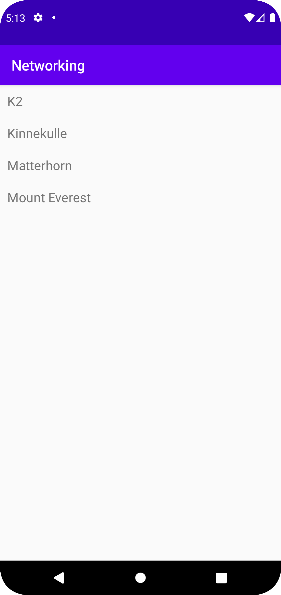

# Rapport

Gör det möjligt att använda RecyclerView.

```
    implementation "androidx.recyclerview:recyclerview:1.2.1"
    // For control over item selection of both touch and mouse driven selection
    implementation "androidx.recyclerview:recyclerview-selection:1.1.0"
```

Fixar "Invoke-customs are only supported starting with android 0 --min-api 26" error.

```
    compileOptions {
        sourceCompatibility JavaVersion.VERSION_1_8
        targetCompatibility JavaVersion.VERSION_1_8

    }
```

Gör det möjligt att använda internet.

```
    <uses-permission android:name="android.permission.INTERNET" />
```

Deklarerar variablerna som ska användas.

```
    private final String JSON_URL = "https://mobprog.webug.se/json-api?login=brom";

    private ArrayList<Mountain> mountains;
    private RecyclerView.Adapter adapter;
    RecyclerView recyclerView;
```

Sätter recyclerView till recycler_view.

```
        recyclerView = findViewById(R.id.recycler_view);
```

Startar nedladdningen från JSON_URL.

```
        new JsonTask(this).execute(JSON_URL);
```

Skapar en Gson som översätter json till en ArrayList<Mountain> som matas in i adaptern som recyclerView sätts till att använda och recyclerView sätts till att använda en ny LinearLayoutManager med context this. 

```
    @Override
    public void onPostExecute(String json) {
        // Create GSON object to perform marshall/unmarshall operations
        Gson gson = new Gson();

// Unmarshall JSON -> list of objects
        Type type = new TypeToken<ArrayList<Mountain>>() {}.getType();
        mountains = gson.fromJson(json, type);
        adapter = new MyAdapter(mountains);
        recyclerView.setAdapter(adapter);
        recyclerView.setLayoutManager(new LinearLayoutManager(this));
    }
```

En RecyclerView.ViewHolder som hittar item_mountain.xml i itemView med dess ID "title".

```
package com.example.networking;

import android.view.View;
import android.widget.TextView;

import androidx.annotation.NonNull;
import androidx.recyclerview.widget.RecyclerView;

public class MyViewHolder extends RecyclerView.ViewHolder {
    public TextView title;

    public MyViewHolder(@NonNull View itemView) {
        super(itemView);
        title = itemView.findViewById(R.id.title);

    }
}
```

En RecyclerView.Adapter<MyViewHolder> som fyller en MyViewHolder med en view inflaterat med item_mountain och sen sätter texterna till namnen på mountains som är en ArrayList av Mountain som blir satt i konstruktorn.

```
package com.example.networking;

import android.view.LayoutInflater;
import android.view.View;
import android.view.ViewGroup;

import androidx.annotation.NonNull;
import androidx.recyclerview.widget.RecyclerView;

import java.util.ArrayList;
import java.util.Arrays;
import java.util.List;

public class MyAdapter extends RecyclerView.Adapter<MyViewHolder> {

    private ArrayList<Mountain> mountains;

    public  MyAdapter(ArrayList<Mountain> mountains){
        this.mountains = mountains;
    }

    @NonNull
    @Override
    public MyViewHolder onCreateViewHolder(@NonNull ViewGroup parent, int viewType) {
        View view = LayoutInflater.from(parent.getContext()).inflate(R.layout.item_mountain, parent, false);
        return new MyViewHolder(view);
    }

    @Override
    public void onBindViewHolder(@NonNull MyViewHolder holder, int position) {
        holder.title.setText(mountains.get(position).getName());
    }

    @Override
    public int getItemCount() {
        return mountains.size();
    }
}
```

item_mountain.xml med en TextView med ID "title" i en LinearLayout.

```
<?xml version="1.0" encoding="utf-8"?>
<LinearLayout xmlns:android="http://schemas.android.com/apk/res/android"
    android:layout_width="match_parent"
    android:layout_height="wrap_content"
    android:orientation="horizontal"
    android:padding="10dp">

    <TextView
        android:id="@+id/title"
        android:layout_width="wrap_content"
        android:layout_height="wrap_content"
        android:textSize="18sp"/>

</LinearLayout>
```

Bytte ut en TextView med texten "Hello World!" till en RecyclerView med ID "recycler_view".

```
    <androidx.recyclerview.widget.RecyclerView
        android:id="@+id/recycler_view"
        android:layout_width="match_parent"
        android:layout_height="match_parent"
        app:layout_constraintBottom_toBottomOf="parent"
        app:layout_constraintLeft_toLeftOf="parent"
        app:layout_constraintRight_toRightOf="parent"
        app:layout_constraintTop_toTopOf="parent" />
```

En Mountain klass med variabler som kan hämtas med getters.

```
package com.example.networking;

public class Mountain {

    String ID;
    String name;
    String location;
    int size;
    int cost;

    public String getID() {
        return ID;
    }

    public String getName() {
        return name;
    }

    public String getLocation() {
        return location;
    }

    public int getSize() {
        return size;
    }

    public int getCost() {
        return cost;
    }
}
```

Screenshot av skärmen fylld med namnen på bergen.

